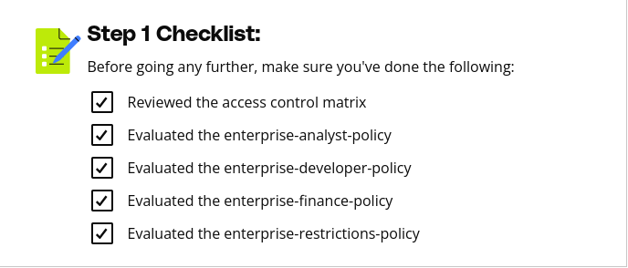

# Purpose of this Folder

This folder should contain the starter code and instructions for the exercise.

Step 1 Instructions
Using the access control matrix document in the classroom resources, evaluate the IAM permissions that were associated with the policies created as part of the iam-policies CloudFormation stack.

Each role defined in the access control matrix has an accompanied policy, and an additional policy has been created to enforce general restrictions.

No deliverable needs to be provided here, but take the time to analyze and understand the permissions that should be assigned to each role.

