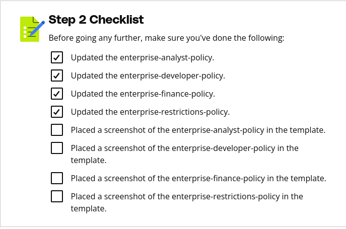

# Purpose of this Folder

This folder should contain the starter code and instructions for the exercise.

Step 2 Instructions
Within the AWS console, navigate to the IAM service and navigate to Policies. Search for each of the following policies, and update each IAM policy to only have statements that can be directly associated with the permissions defined in the access control matrix. Only statements should be removed. No elements or permissions within the statement need to be updated or removed.

enterprise-analyst-policy
enterprise-developer-policy
enterprise-finance-policy
enterprise-restrictions-policy
Within the submission template, under Task 2, please provide screenshots of each updated policy and label the screenshots with the name of the policy. If needed, copy the json to a text file and take a screenshot so that the whole policy can be reviewed.

