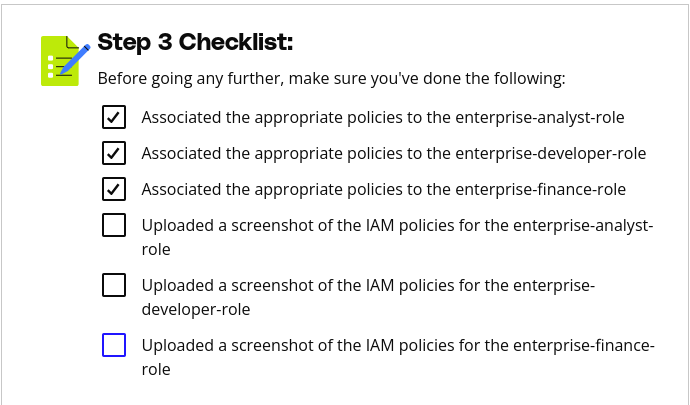

# Purpose of this Folder

This folder should contain the starter code and instructions for the exercise.

Step 3 Instructions
Using the previously updated policies, the policies should now be associated with their matching roles. Each policy should have the accompanied role associated with it, and each role should have the enterprise-restrictions-policy attached. Within the AWS console, navigate to the IAM service and navigate to Roles. Associate the appropriate policies to the following roles:

enterprise-analyst-role
enterprise-developer-role
enterprise-finance-role
Within the project submission template under Steps 1 & 2 > Submission 2, provide screenshots of the following while labeling the screenshot the name of the role:

for the enterprise-analyst-role, attach the following policies:
enterprise-analyst-policy
enterprise-restrictions-policy
for the enterprise-developer-role, attach the following policies:
enterprise-developer-policy
enterprise-restrictions-policy
for the enterprise-finance-role, attach the following policies:
enterprise-finance-policy
enterprise-restrictions-policy

