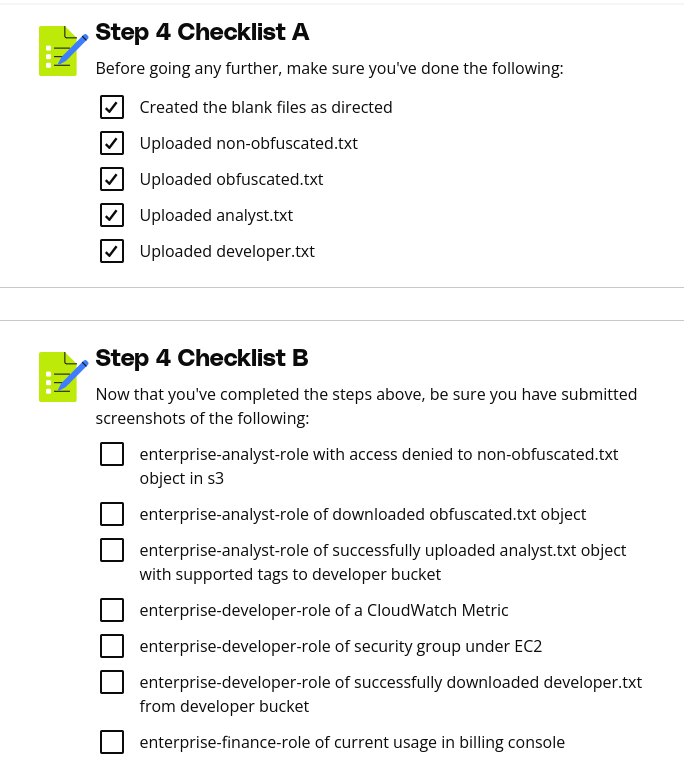

# Purpose of this Folder

This folder should contain the starter code and instructions for the exercise.

Step 4 Instructions
Now that the IAM policies have been refined and attached to their appropriate roles, the roles can be tested to ensure the appropriate access has been defined.

Before testing though, some S3 objects need to be created so that access can be properly tested. Create blank text files with the following names:

non_obfuscated.txt
obfuscated.txt
analyst.txt
developer.txt.
After creating these files, navigate to the S3 console, and locate the analytics-report-bucket-{aws_account_id} (replace {aws_account_id} with your AWS account id). Upload the the non_obfuscated.txt file and tag the object with a key of Stage and a value of NonObfuscatedReport. Also, upload the obfuscated.txt file and tag the object with a key of Stage and a value of ObfuscatedReportReady. The additional files will be used later.

enterprise-analyst-role
After this initial setup has been completed, assume the enterprise-analyst-role in the AWS console. Navigate to the analytics-report-bucket-{aws_account_id} and attempt to access both objects that were previously uploaded. Within the submission template, under Steps 3 & 4, provide screenshots of the results when accessing the non_obfuscated.txt and obfuscated.txt. Be sure to include a full screenshot to display the current role that is being assumed.

Subsequently, navigate to the S3 service and locate the legacy-developer-bucket-{aws_account_id} . Replace {aws_account_id} with your AWS account id. Upload the analyst.txt file to the bucket and tag the object with a key of Role and value of analyst.

Within the submission template, under Steps 3 & 4 > Submission 3, provide screenshots of the results when uploading the analyst.txt file. Be sure to include a full screenshot to display the current role that is being assumed, and label the screenshot analyst.txt upload.

After completing the above, switch back to the voclabs role.

enterprise-developer-role
After switching back to the voclabs role, assume the enterprise-developer-role. Subsequently, navigate to the S3 service and locate the legacy-developer-bucket-{aws_account_id}. Upload the developer.txt file to the bucket and tag the object with a key of Role and value of developer.

Within the submission template, under Steps 3 & 4 > Submission 3, provide screenshots of the results when uploading the developer.txt file. Be sure to include a full screenshot to display the current role that is being assumed. After uploading the developer.txt file, also download it, and within the submission template, under Steps 3 & 4 > Submission 3, provide screenshots of the results when uploading the developer.txt file.

After testing the S3 permissions, navigate to the CloudWatch service and navigate to Metrics. Within the submission template, under Steps 3 & 4 > Submission 3 provide a screenshot of successfully viewing a CloudWatch metric.

After validating the CloudWatch access granted to the role, navigate to the EC2 service and navigate to Security Groups. Within the submission template, under Steps 3 & 4 > Submission 3 provide a screenshot of successfully viewing a CloudWatch metric.

After completing the above, switch back to the voclabs role.

enterprise-finance-role
After switching back to the voclabs role, assume the enterprise-finance-role. Subsequently, navigate to the Billing service. Within the submission template, under Steps 3 & 4 > Submission 3, provide a screenshot of successfully accessing the Cost Explorer dashboard, as shown in the screenshot below.

