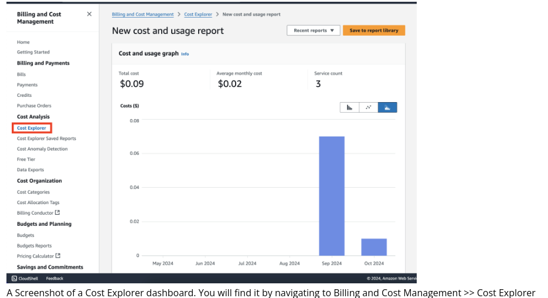
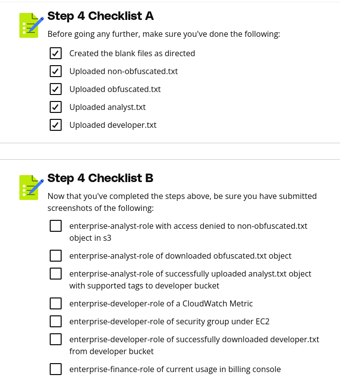

# Purpose of this Folder

This folder should contain the starter code and instructions for the exercise.

## Step 4 Instructions

Now that the IAM policies have been refined and attached to their appropriate roles, the roles can be tested to ensure the appropriate access has been defined.

### Preparing S3 Objects

Before testing, create blank text files with the following names:

- `non_obfuscated.txt`
- `obfuscated.txt`
- `analyst.txt`
- `developer.txt`

1. Navigate to the S3 console.
2. Locate the `analytics-report-bucket-{aws_account_id}` (replace `{aws_account_id}` with your AWS account ID).
3. Upload the following files and tag them accordingly:
   - **`non_obfuscated.txt`**: Tag with `Key = Stage` and `Value = NonObfuscatedReport`.
   - **`obfuscated.txt`**: Tag with `Key = Stage` and `Value = ObfuscatedReportReady`.

The additional files (`analyst.txt` and `developer.txt`) will be used later.

---

### Testing with `enterprise-analyst-role`

1. Assume the `enterprise-analyst-role` in the AWS console.
2. Navigate to the `analytics-report-bucket-{aws_account_id}`:
   - Attempt to access both objects: `non_obfuscated.txt` and `obfuscated.txt`.
   - Provide full screenshots of the results, ensuring the current role is displayed.

3. Navigate to the S3 service and locate the `legacy-developer-bucket-{aws_account_id}`:
   - Upload the `analyst.txt` file and tag it with `Key = Role` and `Value = analyst`.
   - Provide a screenshot labeled `analyst.txt upload`, ensuring the current role is visible.

4. Switch back to the `voclabs` role.

---

### Testing with `enterprise-developer-role`

1. Assume the `enterprise-developer-role`.
2. Navigate to the S3 service and locate the `legacy-developer-bucket-{aws_account_id}`:
   - Upload the `developer.txt` file and tag it with `Key = Role` and `Value = developer`.
   - Provide a full screenshot labeled `developer.txt upload`, ensuring the current role is visible.
   - Download the `developer.txt` file and provide a screenshot of the results.

3. Navigate to the CloudWatch service:
   - Access the Metrics section.
   - Provide a screenshot of successfully viewing a CloudWatch metric.

4. Navigate to the EC2 service:
   - Access the Security Groups section.
   - Provide a screenshot of successfully viewing a security group.

5. Switch back to the `voclabs` role.

---

### Testing with `enterprise-finance-role`

1. Assume the `enterprise-finance-role`.
2. Navigate to the Billing service:
   - Access the Cost Explorer dashboard.
   - Provide a screenshot of successfully accessing the dashboard.

   > **Note:** Some Billing services may not be accessible due to security restrictions in the Udacity-provided AWS account.

3. Switch back to the `voclabs` role.

---

### Example Screenshots

