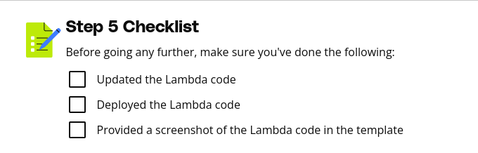

# Purpose of this Folder

This folder should contain the starter code and instructions for the exercise.

Step 5 Instructions
Now that the permissions have been validated and tested, resource restrictions need to be enforced.

Navigate to the Lambda service, and locate the lambda named config-rule-enforcement.
Click on the config-rule-enforcement, and update the Python Lambda to include the arn:aws:s3:::super-secret-bucket resource as part of the restricted resources.
Be sure to deploy the updated Lambda code.
Within the submission template, under Steps 5 & 6 > Submission 4, provide a screenshot of the updated Lambda code in the console. 
/* 
- This set of submission instructions makes no sense. You provided a repository that doesn't coincide with your lesson modules.
- I feel like this entire course"3" is an incomplete lesson plan that sets students up for failure
- There are no lambda functions named config-rule-enforcement to edit and we have to create it ourselves
 */

 

