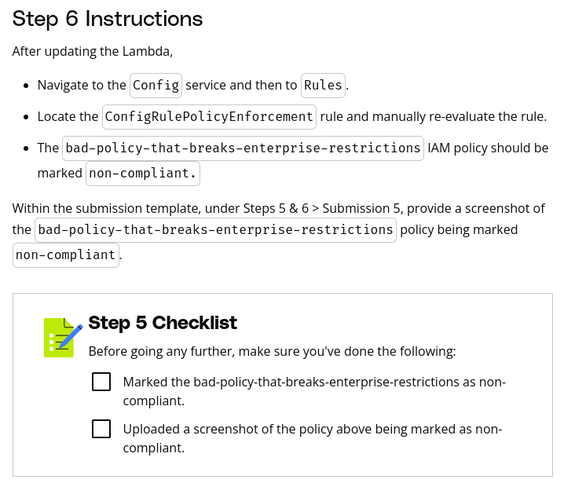

# Purpose of this Folder

This folder should contain the starter code and instructions for the exercise.

Step 6 Instructions
After updating the Lambda,

Navigate to the Config service and then to Rules.
Locate the ConfigRulePolicyEnforcement rule and manually re-evaluate the rule.
The bad-policy-that-breaks-enterprise-restrictions IAM policy should be marked non-compliant.
Within the submission template, under Steps 5 & 6 > Submission 5, provide a screenshot of the bad-policy-that-breaks-enterprise-restrictions policy being marked non-compliant.

// Why is there a step 5 checklist in step 6. You need to reiterate lesson 5 instructions that carry over to 6 for "template"