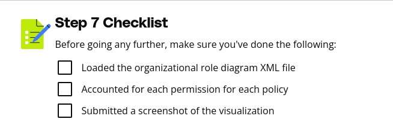

# Purpose of this Folder

This folder should contain the starter code and instructions for the exercise.

Step 7 Instructions
After implementing, testing, and enforcing these roles, policies and permissions, it is time to design a visualization to document the work that has been done. Using draw.io, load the organizational role diagram xml file downloaded from the classroom resources and start editing it.

Using the permissions defined in the “Permissions To Match to Resources in Policy” table, drag each permission to the right of the proper resource in the policy. These permissions should reflect those defined on the policies in the AWS console as well as those specified within the access control matrix.

Within the submission template, under Step 7, provide a screenshot of your organizational role and policy visualization.

